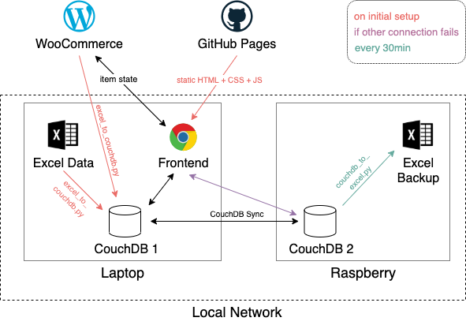

# LeihLokalVerwaltung
Easy management of products, rentals and customers

## Development Container Setup

All 3 components (Frontend, ExcelCouchDbSync and CouchDb) can easily be run in docker containers.

### Advantages of using containers for development

- no need to install and run node, python or a database manually on your host machine
- same development environment on all devices

### Getting Started

1. Install [Visual Studio Code](https://code.visualstudio.com/) and the [Remote Development Extention](https://marketplace.visualstudio.com/items?itemName=ms-vscode-remote.vscode-remote-extensionpack)

2. Install and run [Docker](https://www.docker.com/products/docker-desktop)

3. Open this project in Visual Studio Code

4. Set the correct path to your local excel file in [this line](https://github.com/leih-lokal/LeihLokalVerwaltung/blob/74bf1e1f3ad0f405c00cb17c339b8b32451635cc/.devcontainer/docker-compose.yml#L48)

5. Click on "Reopen in Container". The ExcelCouchDbSync and CouchDb are started and configured automatically and all excel data is written to CouchDb. Running this the first time will take some time since all docker images need to be downloaded.

6. To also start the Frontend, open a Terminal in Visual Studio (which is running inside the container) and execute `cd Frontend && npm run dev`. Then, use your browser to navigate to the url appearing in the console.
