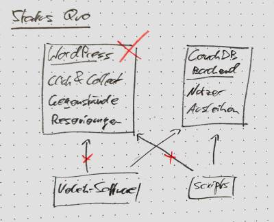
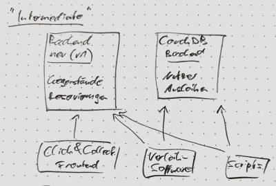
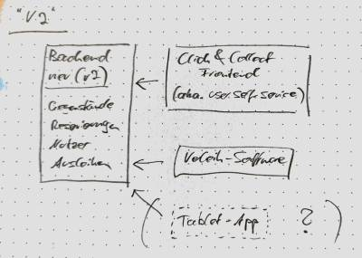

# LeihLokalVerwaltung

## 🚧 Work in progress 🚧

We're currently in the process of refactoring our software's architecture. Specifically, we aim to drop WooCommerce and CouchDB and instead develop [leihbackend](https://github.com/leih-lokal/leihbackend), based on [PocketBase](https://pocketbase.io), as a central data backend. _LeihLokalVerwaltung_ will remain conceptually the same, only be rewired to the new backend. In addition, [leihfrontend](https://github.com/leih-lokal/leihfrontend) will serve as a (WordPress-free) public-facing website for our customers.

### Roadmap

**Status Quo:**

**Intermediate Stage:**

**Finale Stage:**

### To Dos
* [x] Reservations
  * [x] Data model + backend API
  * [x] New frontend UI
* [x] Items
    * [x] Data model + backend API
    * [x] Data importer
    * [x] Rewire old frontend code
* [x] Customers
    * [x] Data model + backend API
    * [x] Data importer
    * [x] Rewire old frontend code
* [ ] Rentals
    * [x] Data model + backend API
    * [x] Data importer
    * [x] Rewire old frontend code
    * [ ] New frontend UI for "shopping cart" feature
* [ ] Miscellaneous
    * [x] Authorization / API rules to expose API publicly
    * [ ] New integration- / E2E tests
    * [ ] Upgrade Svelte (and others) to latest version

---

## Description

Easy management of products, rentals and customers. Feel free to use it! Let us know what can be improved! Please contact us if you want to set this up for your Leihladen (Library of Things), we'll help you install it, and write an how-to as a by-product (currently we didn't have time to write a user-friendly documentation, as there was no need yet).

You can contact us via `leihlokal (ät) buergerstiftung-karlsruhe.de`

## Setup
    cd Frontend
    npm install

## Run
### Development
    npm run dev

### Production
    npm run build

    # alternatively, to serve under a subpath:
    BASE_URL=/backend npm run build

## Local Setup

## Requirements

- [leihbackend](https://github.com/leih-lokal/leihbackend)
- NodeJS + [npm](https://github.com/npm/cli)
- Optional: [Docker](https://www.docker.com/) (required only when testing with real database)
- Optional: [Docker Compose](https://docs.docker.com/compose/install/) (required only when testing with real database)
